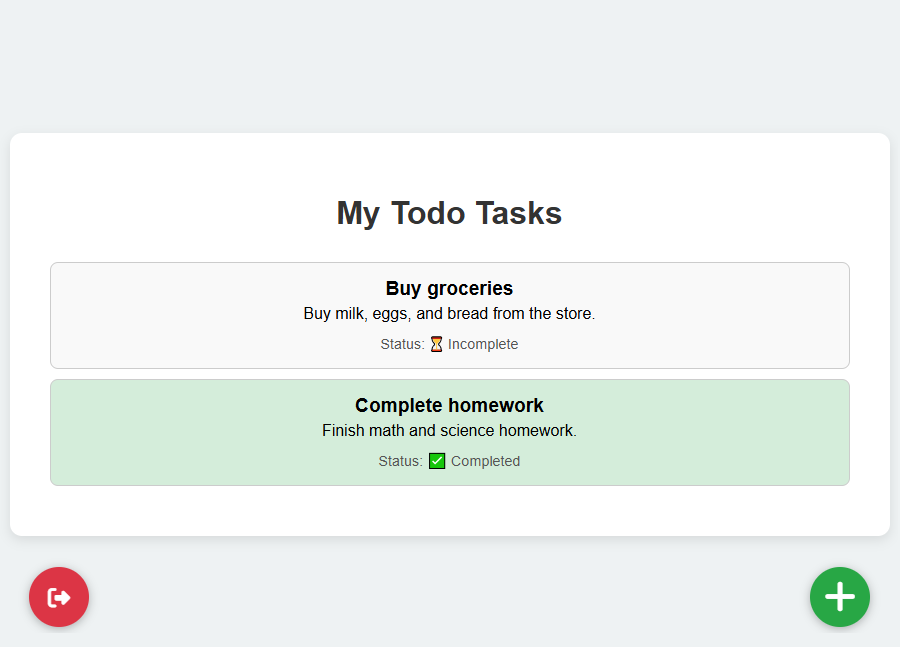
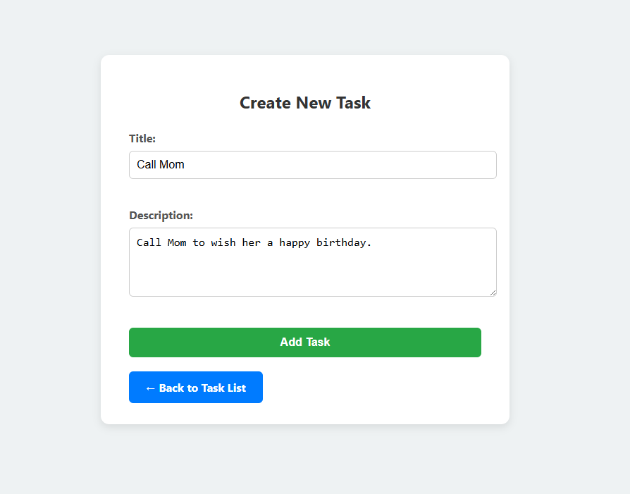
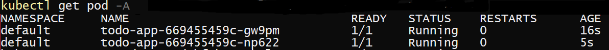

---

# ✅ ToDo App – Django + Docker + Kubernetes

A full-featured **To-Do web application** built with **Django**, containerized using **Docker**, and deployed using **Kubernetes (Minikube)**. It includes user registration/login, task management, and health-check endpoints.

---

## 🖼️ Preview

### 📋 Task List Page



### ➕ Add Task Page



---

## 📦 Project Structure

```
.
├── deployment.yaml
├── Dockerfile
├── README.md
├── requirements.txt
├── service.yaml
├── .gitignore
└── ToDo/
    ├── manage.py
    ├── db.sqlite3
    ├── credentials.py
    ├── ToDo/
    ├── frontend/
    ├── tasks/
    └── user/
```

---

## 🚀 Features

* ✔️ User authentication (register/login)
* ✔️ Create, read, update, delete tasks
* ✔️ HTML templates with Django views
* ✔️ API support via Django REST Framework (DRF)
* ✔️ Containerized with Docker
* ✔️ Deployed using Kubernetes (Minikube)
* ✔️ Liveness probe with `/health` endpoint

---

## 🐳 Docker

### Dockerfile

```Dockerfile
FROM python:3.11-slim
WORKDIR /app
COPY requirements.txt .
RUN pip install --upgrade pip
RUN pip install -r requirements.txt
COPY . .
EXPOSE 5000
CMD ["python", "ToDo/manage.py", "runserver", "0.0.0.0:5000", "--noreload"]
```

### Build and Run

```bash
docker build -t yourusername/todo-app .
docker run -p 5000:5000 yourusername/todo-app
```

Visit: [http://localhost:5000](http://localhost:5000)

### ☁️ Push to Docker Hub

1. **Tag your image:**

   ```bash
   docker tag todo-app yourusername/todo-app
   ```

2. **Login to Docker Hub:**

   ```bash
   docker login
   ```

3. **Push your image:**

   ```bash
   docker push yourusername/todo-app
   ```

Make sure to replace `yourusername` with your actual Docker Hub username.


---

## ☸️ Deploy with Kubernetes (Minikube)

```bash
minikube start --driver=docker
kubectl apply -f deployment.yaml
kubectl apply -f service.yaml
minikube service todo-service
```

---

## 📸 Kubernetes Pod Status

### `kubectl get pods` Output



---

## 📝 Kubernetes Manifests

### Deployment (`deployment.yaml`)

```yaml
apiVersion: apps/v1
kind: Deployment
metadata:
  name: todo-app
spec:
  replicas: 2
  selector:
    matchLabels:
      app: todo
  template:
    metadata:
      labels:
        app: todo
    spec:
      containers:
        - name: todo
          image: yourusername/todo-app
          ports:
            - containerPort: 5000
          livenessProbe:
            httpGet:
              path: /health
              port: 5000
            initialDelaySeconds: 5
            periodSeconds: 10
```

### Service (`service.yaml`)

```yaml
apiVersion: v1
kind: Service
metadata:
  name: todo-service
spec:
  selector:
    app: todo
  ports:
    - protocol: TCP
      port: 80
      targetPort: 5000
  type: NodePort
```
---
### Manual Scaling

```bash
kubectl scale deployment todo-app --replicas=3
```

### Autoscaling with HPA

```bash
kubectl autoscale deployment todo-app --cpu-percent=50 --min=2 --max=5
```

> Requires Metrics Server to be installed in Minikube.

---

## 📋 Requirements

* Python 3.9+
* Docker
* Docker Hub account
* Minikube + kubectl

---

## ⚠️ Note on Credentials and Database

* `db.sqlite3`: pre-filled for demo
* `credentials.py`: contains test credentials

**Do not use in production.**

---

## 🙋 Author

**Mohammad Majooni**
GitHub: [@mohammad-majoony](https://github.com/mohammad-majoony)

---


